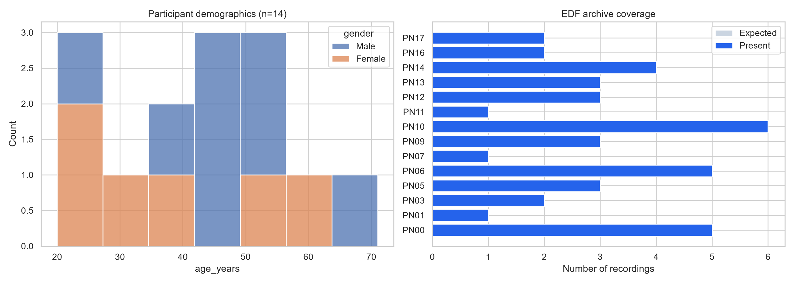
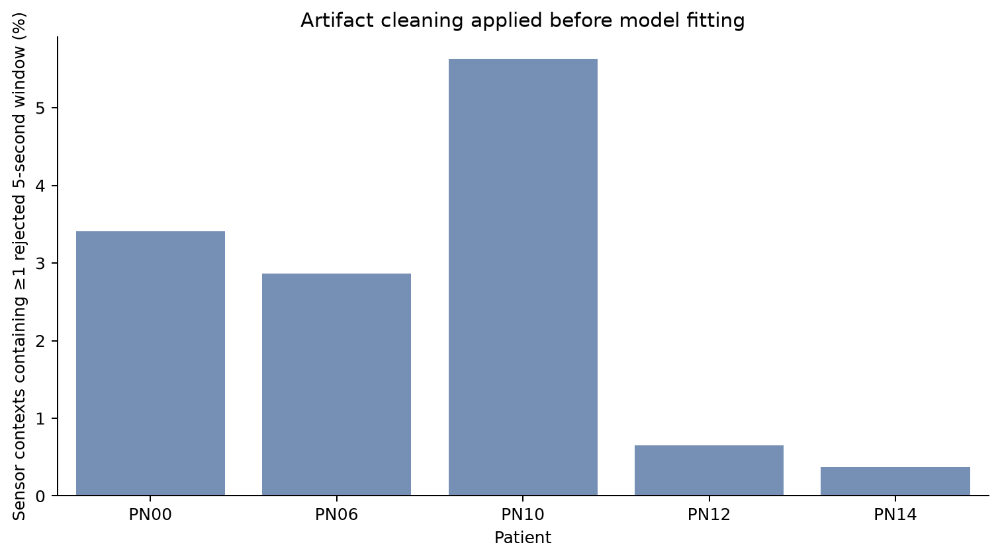
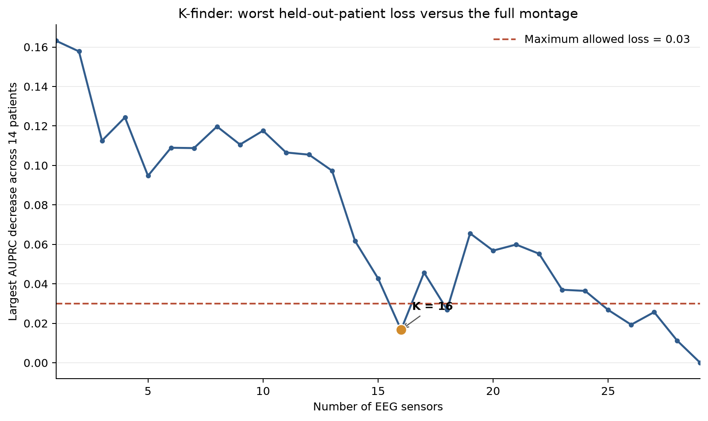
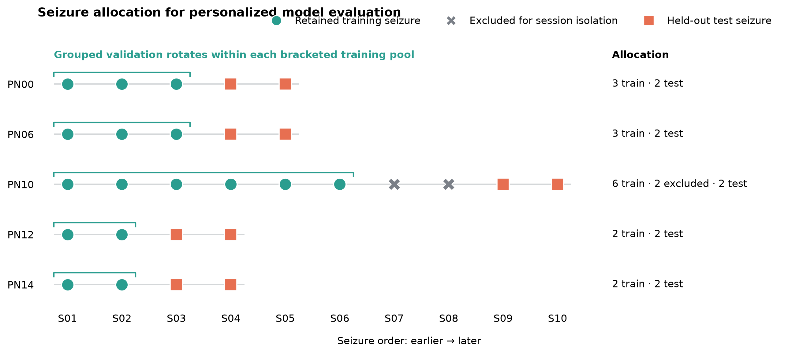
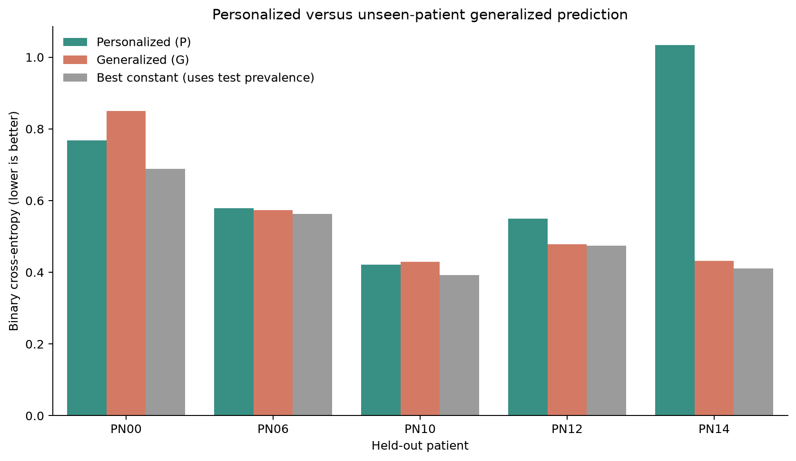
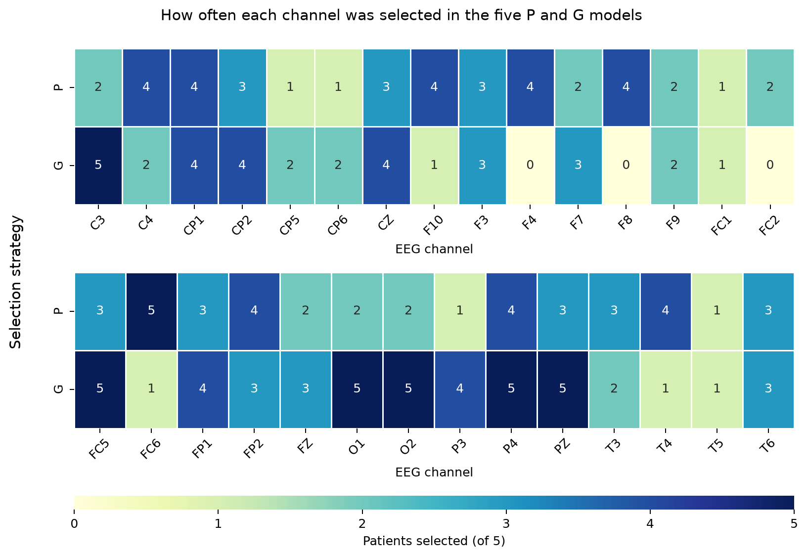

# Personalized EEG sensor selection for seizure prediction

## Final answer

This project does **not** show that seizures can yet be predicted accurately
from this dataset.

It does support one narrower result:

- **16 of the 29 EEG sensors shared by every patient** preserved the full
  model's held-out ranking performance within the requested worst-patient
  AUPRC loss of 0.03.
- This is preservation of a weak reference model, not proof of accurate
  seizure prediction. The 16-sensor model's mean held-out AUPRC was 0.243,
  versus 0.238 for all 29 sensors and a mean positive fraction of 0.209. It
  scored below that positive-rate reference in 6 of 14 patients.
- Personalization did not reliably help. The generalized model had lower
  cross-entropy for 3 of 5 patients; the personalized model had lower loss for
  2 of 5. The exact paired sign-flip test was `p = 0.6875`.
- The strict intersection across all ten personalized and generalized channel
  sets was empty. There is no single channel selected by every final model.

These are exploratory research results, not a clinical warning system.

## Research question

> Can seizures be accurately predicted using fewer EEG sensors, and can
> patient-specific sensor selection outperform one sensor set for everyone?

We answered it in three parts:

1. **K-finder:** How many sensors preserve the full common montage?
2. **K-suiter:** Which `K` sensors should a training population use?
3. **P versus G:** Does a small personalized model beat a model trained on the
   other four patients?

## Data

The source is the
[Siena Scalp EEG Database on PhysioNet](https://physionet.org/content/siena-scalp-eeg/1.0.0/):
14 patients, 41 EDF recordings, 47 annotated seizures, 512 Hz scalp EEG.

The team originally referred to a 31-sensor full montage. Only **29 EEG
channels are common to all 14 patients**. Three patients have 29 EEG channels;
the others have 31. The full-montage comparison therefore uses the common 29,
not non-EEG signals such as ECG or SpO2.



## What was repaired

Every legacy script, notebook, figure, and result was inspected. The detailed
file-by-file disposition is in
[the project rescue audit](docs/PROJECT_RESCUE_AUDIT.md).

| Previous problem | Repair |
|---|---|
| K-finder, Gen1, P, and G used incompatible models and targets | One common sensor ensemble now powers every stage |
| Conflicting answers claimed `K = 2`, `4`, `12`, or `22` | One nested held-out-patient rule now produces one auditable result |
| Four patients had only one test seizure | Every target patient now has exactly two held-out seizures |
| Personalized train and test rows reused recording sessions | Entire test recording sessions are now held out |
| PN00 controls shared raw EEG across validation groups | Overlapping controls are regrouped; exact duplicate landmarks are removed |
| G selected channels using information from its target patient | Each G K-suiter sees only the other four patients |
| P and G were scored on different rows | Both are evaluated on the exact same held-out rows |
| The outlier notebook never changed model inputs | Artifact rejection is now inside feature extraction |
| A 30–45 Hz feature was mislabeled after downsampling to 64 Hz | Low gamma is excluded; the final model uses only valid frequencies through beta |
| A “no-skill” loss used test labels without saying so | It is explicitly named the test-prevalence oracle; deployable baselines use training prevalence |
| Stale notebook output could appear successful after code failure | Results now come from one tested command-line run with code and environment hashes |

The team's edited leave-one-patient-out notebook was not discarded. It is
preserved as
[an archived legacy notebook](archive/legacy_k_suiter_leave_one_patient_out.ipynb);
it is not part of the final pipeline.

## Final pipeline

```text
Raw EDF + seizure manifest
          │
          ▼
5-second sensor windows ── artifact rejection
          │
          ▼
21 causal features per sensor from the previous 120 seconds
          │
          ▼
One logistic model per sensor
          │
          ▼
Average selected-sensor probabilities + training-only calibration
          │
      ┌───┴──────────┐
      ▼              ▼
Personalized P   Generalized G
target history   other 4 patients
      └──────┬───────┘
             ▼
same held-out patient sessions
```

At every five-second landmark, the target is whether seizure onset occurs
within the next five minutes. Only the preceding 120 seconds of EEG are used.

For each sensor, the model receives 21 values:

- relative delta, theta, alpha, and beta power;
- log RMS voltage, log line length, and usable-window fraction; and
- the mean, latest value, and slope of each feature over the 120-second
  context.

The common Gen1/base model is median imputation learned from training data,
standardization, and balanced L2 logistic regression (`C = 0.1`). Selected
sensor probabilities are averaged. A positive-slope Platt calibrator is fitted
only to out-of-fold training predictions.

## Data cleaning and leakage checks

The raw archive passed its inventory checks: all 41 EDF files were present,
their supplied SHA-256 checksums matched, and all 1,255 exported
channel-recording arrays had the expected shapes.

Each sensor's five-second window is linearly detrended and rejected when it:

- contains non-finite values;
- is nearly flat (`MAD < 0.05 µV`);
- has extreme scale (`MAD > 250 µV`); or
- has a centered peak above `1,500 µV`.

Rejected physiological values become missing; the usability feature remains
zero. Missing values are filled using only the relevant model's training
partition.

| Patient | Sensor contexts with at least one rejected window | Missing feature values | Duplicate raw landmarks removed |
|---|---:|---:|---:|
| PN00 | 3.41% | 0.031% | 564 |
| PN06 | 2.87% | 0.045% | 0 |
| PN10 | 5.63% | 0.178% | 0 |
| PN12 | 0.65% | 0.008% | 0 |
| PN14 | 0.37% | 0.007% | 0 |

PN00 required 15 control episodes to be regrouped because historical control
windows overlapped across event folds. After cleaning, all five target
patients had:

- zero raw-time overlaps across train/test groups;
- zero exact feature hashes crossing groups; and
- zero infinite feature values.



## K-finder result

K-finder uses all 14 patients. For each outer fold, it:

1. holds out one complete patient;
2. learns a greedy sensor order from the other 13 using patient-grouped inner
   validation;
3. scores every sensor count on the unseen patient with AUPRC; and
4. compares each count with the same fold's 29-sensor model.

The rule is:

```text
choose the smallest K for which
max over patients [AUPRC(29 sensors) - AUPRC(K sensors)] ≤ 0.03
```

The literal result is **K = 16**:

- worst-patient observed loss at K=16: **0.0167**;
- worst-patient loss at K=15: **0.0427**, so K=15 fails;
- mean AUPRC at K=16: **0.2434**;
- mean AUPRC at K=29: **0.2378**.

The curve is not monotonic because the model gives every selected sensor equal
weight; adding a weak sensor can hurt. K=16 is an isolated pass. The conservative
connected plateau, where that count and every larger count pass, begins at
K=25. Because K was selected on this same 14-patient curve, K=16 must be called
an **observed minimum**, not a guaranteed population minimum.



## Personalized versus generalized comparison

Only PN00, PN06, PN10, PN12, and PN14 have at least four seizures. The last
`max(ceil(20% × seizures), 2)` seizures are held out, together with their
entire recording sessions.

| Patient | P train seizures | Excluded for session isolation | Test seizures | G train seizures |
|---|---:|---|---:|---:|
| PN00 | 3 | — | 2 | 23 |
| PN06 | 3 | — | 2 | 23 |
| PN10 | 6 | S07, S08 | 2 | 18 |
| PN12 | 2 | — | 2 | 24 |
| PN14 | 2 | — | 2 | 24 |

PN10's S07 and S08 occur in the same recording as held-out S09. They are
excluded from P training rather than allowing recording-session leakage.



Each symbol is one seizure. Grouped validation rotates within the bracketed
training pool; it is not a separate permanent split. The orange test seizures
remain untouched until final evaluation.

K-suiter ranks channels using training-only out-of-fold cross-entropy:

- **P channels** are selected from that patient's retained training events.
- **G channels** are selected from the other four patients, with the target
  patient completely absent.

### Selected channels

| Patient | Personalized P channels | Generalized G channels |
|---|---|---|
| PN00 | C3, F8, FP2, F4, FC6, FP1, T6, PZ, CZ, F7, P4, C4, F3, F10, CP2, CP1 | C3, F7, P4, CP2, PZ, F9, O2, FC5, CP5, FZ, O1, FP2, CP1, C4, P3, F10 |
| PN06 | FC6, F4, O2, FP2, C4, F10, CP1, T4, FZ, T6, F8, O1, CP6, P4, F9, FC2 | P4, C3, PZ, CZ, O2, FP2, CP1, F3, O1, FZ, FC5, FP1, F7, CP2, T4, FC6 |
| PN10 | C4, F9, T4, CZ, F4, T3, F8, CP2, F7, O2, CP5, FZ, P4, FC5, PZ, FC6 | C3, PZ, CP1, FC1, CP2, FC5, O1, F7, O2, CZ, P4, T3, P3, T6, FP1, FP2 |
| PN12 | FP1, T3, CP1, F10, P3, FC5, FP2, FC6, T5, F3, T4, O1, FC1, T6, F8, C3 | P3, C3, CP6, PZ, CZ, FP1, CP5, O1, T3, T6, O2, FC5, T5, F9, P4, F3 |
| PN14 | F3, FP1, FC6, CZ, T3, CP2, FC5, P4, PZ, T4, F4, F10, C4, CP1, FC2, FP2 | P4, C3, P3, CZ, CP1, PZ, O2, FC5, T6, C4, O1, FZ, FP1, F3, CP2, CP6 |

### Held-out performance using those channels

Lower cross-entropy is better. Higher AUPRC and AUROC are better. “P base” and
“G base” are constant predictions using only the corresponding training
population's positive rate.

| Patient | P loss | P base | P AUPRC | P AUROC | G loss | G base | G AUPRC | G AUROC | Lower loss |
|---|---:|---:|---:|---:|---:|---:|---:|---:|:---:|
| PN00 | 0.768 | 0.769 | 0.716 | 0.661 | 0.849 | 0.853 | 0.461 | 0.320 | P |
| PN06 | 0.579 | 0.579 | 0.387 | 0.529 | 0.574 | 0.565 | 0.164 | 0.243 | G |
| PN10 | 0.421 | 0.401 | 0.104 | 0.413 | 0.429 | 0.419 | 0.112 | 0.456 | P |
| PN12 | 0.550 | 0.479 | 0.142 | 0.399 | 0.478 | 0.478 | 0.412 | 0.722 | G |
| PN14 | 1.034 | 0.504 | 0.117 | 0.434 | 0.432 | 0.428 | 0.237 | 0.761 | G |

The mean loss was 0.670 for P and 0.552 for G, but this small difference is
unstable:

- median G-minus-P loss: `-0.0054`;
- 95% patient bootstrap interval: `[-0.363, 0.036]`;
- exact two-sided sign-flip test: `p = 0.6875`.

The comparison also gives G much more training data than P. It is therefore a
comparison of two requested training regimes, not a pure causal test of
personalization.



## Core channels

Using a strict set intersection:

- P-only core: **FC6**;
- G-only core: **C3, FC5, O1, O2, P4, PZ**;
- intersection across all five P sets and all five G sets: **none**.

Because every model selects 16 of 29 channels, overlap is expected by chance.
The P-only and G-only intersections should be treated as descriptive, not
biomarkers.



## What the results mean

The honest conclusion is:

> Fewer sensors can reproduce this model's weak full-montage ranking, but the
> current evidence does not establish accurate seizure prediction or an
> advantage for personalized sensor selection.

Some patient/model pairs rank windows above chance, but the behavior is not
consistent, calibration is often no better than a constant training-rate
prediction, and only ten seizures are in the final test sets.

## Limitations

- Only five patients support P-versus-G testing, with two test seizures each.
- P uses 2–6 retained training seizures; G uses 18–24. Training volume is
  confounded with model type.
- Controls are sampled seizure-free episodes, not continuous monitoring.
  False alarms per hour and clinical sensitivity cannot be estimated honestly.
- Landmarks within an episode are highly correlated.
- PN12 test seizure S03 has no sampled negative episode in the same recording.
- Recording filename order is used as chronology because absolute session
  timestamps are unavailable.
- K=16 was selected and described on the same outer-fold curve.
- `C = 0.1` was chosen after a provisional regularization sensitivity check on
  this project data; it was not selected inside a separate nested loop.
- There is no external cohort.

## Repository map

```text
final_project/
├── README.md                         # Plain-language report
├── run_analysis.py                   # One command: K-finder + P/G + figures
├── build_feature_cache.py            # Raw EEG → channel feature caches
├── requirements.txt
├── src/
│   ├── eeg_io.py                     # Calibrated EDF/split-data reading
│   ├── channel_features.py           # Artifact cleaning and feature extraction
│   └── reduced_sensor_pipeline.py    # Shared Gen1/K/P/G implementation
├── tests/                            # Leakage, split, calibration, and cache tests
├── metadata/
│   ├── episode_manifest.csv
│   ├── episode_manifest_metadata.json
│   └── raw_audit/
├── results/final/
│   ├── figures/                      # Only current report figures
│   └── tables/                       # Only current numerical results
├── docs/
│   ├── METHODS.md
│   ├── DATA_DOWNLOAD.md
│   ├── PROJECT_RESCUE_AUDIT.md
│   └── LOCAL_MACHINE_HANDOFF_PROMPT.md
├── archive/                          # Preserved team edit; never imported
└── data/
    ├── raw/                          # Original PhysioNet data; ignored by Git
    └── processed/                    # Rebuildable caches; ignored by Git
```

## Reproduce

From `26-the-optimizers-analysis/final_project`:

```bash
python -m venv .venv
source .venv/bin/activate
pip install -r requirements.txt
```

Download and verify the raw data from the repository root as described in
[the data guide](docs/DATA_DOWNLOAD.md), then run:

```bash
python build_feature_cache.py --force
python run_analysis.py --n-jobs -1
python -m pytest -q
```

The feature build is the slow step. Existing valid caches are reused unless
`--force` is supplied. `run_analysis.py` deliberately has no “reuse K” option,
so a stale K result cannot silently be combined with new P/G results.

## Result files

- [Main patient table](results/final/tables/main_results_table.csv)
- [Full model comparison](results/final/tables/patient_model_comparison.csv)
- [K-finder summary](results/final/tables/k_finder_summary.json)
- [K-finder curve](results/final/tables/k_finder_loss_curve.csv)
- [Per-patient K scores](results/final/tables/k_finder_patient_scores.csv)
- [Fold-specific K sensor paths](results/final/tables/k_finder_channel_paths.csv)
- [All K-suiter rankings](results/final/tables/channel_rankings.csv)
- [Core channels](results/final/tables/core_channels.csv)
- [Held-out event losses](results/final/tables/held_out_event_losses.csv)
- [Held-out landmark predictions](results/final/tables/held_out_predictions.csv)
- [Data-quality audit](results/final/tables/data_quality_summary.csv)
- [Run provenance](results/final/tables/run_metadata.json)

See [METHODS.md](docs/METHODS.md) for exact definitions and cautions.
The [local-machine handoff prompt](docs/LOCAL_MACHINE_HANDOFF_PROMPT.md)
records the verified state and commit/push-only continuation steps.
